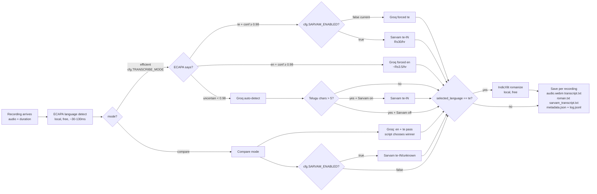

# AudioTranscript — server pipeline

```mermaid
flowchart LR
    A[Recording arrives<br/>audio + duration] --> B[ECAPA language detect<br/>local, free, ~30-130ms]
    B --> C{mode?}
    C -- efficient<br/>cfg.TRANSCRIBE_MODE --> D{ECAPA says?}
    C -- compare --> H[Compare mode]

    D -- "te + conf ≥ 0.98" --> E{cfg.SARVAM_ENABLED?}
    E -- false current --> E1[Groq forced te] --> R
    E -- true --> E2[Sarvam te-IN<br/>Rs30/hr] --> R

    D -- "en + conf ≥ 0.98" --> F[Groq forced en<br/>~Rs3.5/hr] --> R

    D -- "uncertain < 0.98" --> G[Groq auto-detect] --> G1{Telugu chars > 5?}
    G1 -- no --> R
    G1 -- "yes + Sarvam on" --> G2[Sarvam te-IN] --> R
    G1 -- "yes + Sarvam off" --> R

    H --> H1[Groq: en + te pass<br/>script chooses winner] --> R
    H --> H2{cfg.SARVAM_ENABLED?}
    H2 -- true --> H3[Sarvam te-IN/unknown] --> R
    H2 -- false --> R

    R{selected_language == te?}
    R -- yes --> R1[IndicXlit romanize<br/>local, free] --> S
    R -- no --> S[Save per recording<br/>audio.webm transcript.txt<br/>roman.txt sarvam_transcript.txt<br/>metadata.json + log.jsonl]
```

Settings live in `services/api/config.py` — flip `SARVAM_ENABLED` / `TRANSCRIBE_MODE` there; this diagram's branches follow them.

